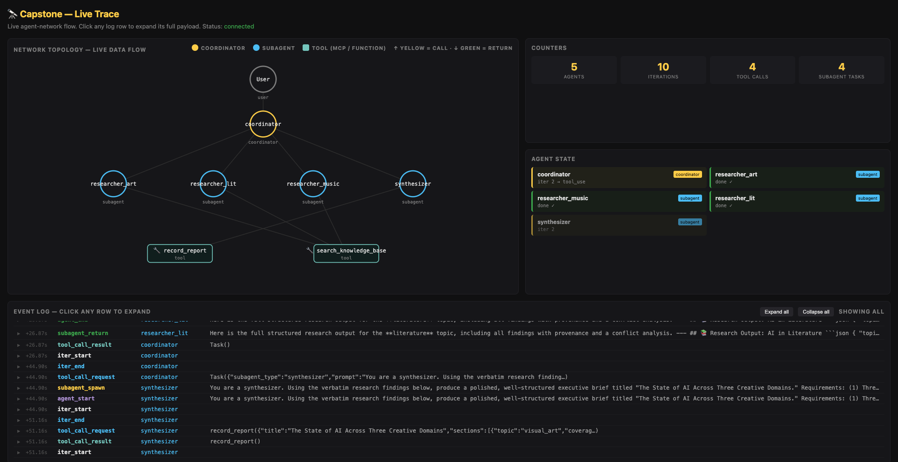

# Claude Architect Lab

Hands-on training repo for the **Claude Certified Architect — Foundations** certification.

One module at a time. Each module has a short theory briefing, a set of runnable coding exercises, and a quick quiz. By the end, the `src/` tree becomes a working multi-agent research network.

> **Source guide.** The exam guide that drives this lab's curriculum (`guide_en.MD`) lives in the community-maintained repo by Paul Larionov: <https://github.com/paullarionov/claude-certified-architect>. It is **not** vendored into this repo — read it at the source. The lab here is a hands-on companion built around that guide — every module maps to a chapter / domain section of the guide, and the **Exam traps** rows in each `revision/module-*.md` file are condensed from it.

## Prerequisites

- Node.js 18+ (uses native `fetch` and ES modules)
- npm
- An Anthropic API key — get one at <https://console.anthropic.com>

## One-time setup

```bash
cd claude-architect-lab
npm install
cp .env.example .env       # then paste your real ANTHROPIC_API_KEY into .env
```

## Modules

| #   | Module                                 | Exam domain |
| --- | -------------------------------------- | ----------- |
| 1   | Claude API Fundamentals                | Foundations |
| 2   | Tools and tool_use                     | D2 / D4     |
| 3   | Agent SDK and Agentic Loops            | D1          |
| 4   | Model Context Protocol (MCP)           | D2          |
| 5   | Claude Code Configuration              | D3          |
| 6   | Prompt Engineering                     | D4          |
| 7   | Message Batches API                    | D4          |
| 8   | Task Decomposition                     | D1          |
| 9   | Escalation & Human-in-the-Loop         | D5          |
| 10  | Error Handling in Multi-Agent Systems  | D5          |
| 11  | Context Management                     | D5          |
| 12  | Preserving Provenance                  | D5          |
| 13  | Claude Code Built-in Tools             | D2 / D3     |
| —   | Capstone: Multi-Agent Research Network | All         |

---

## Module 1 — Claude API Fundamentals

Build a mental model of the raw Claude API: how a request is shaped, why the API is stateless, how `stop_reason` drives every agent loop, and how the context window fills up. After this module you can write a minimal agent loop from scratch without an SDK.

### `npm run m1:hello`

Request/response shape and API statelessness — every call is independent.
_What you'll observe:_ the full response object, the text at `content[0].text`, `stop_reason: "end_turn"`, and a token-usage breakdown.

### `npm run m1:roles`

The `messages` array is the only state carrier — conversation lives entirely in what you pass back.
_What you'll observe:_ two parallel runs — one that passes the prior turns recalls a fact ("favorite number is 7"); the one without history has total amnesia.

### `npm run m1:stop`

The four `stop_reason` values and why your loop must branch on them.
_What you'll observe:_ four labeled responses — `end_turn` (clean), `max_tokens` (mid-word cutoff), `stop_sequence` (text ends before the sentinel), and a noted-but-not-triggered `tool_use` (covered in Module 2).

### `npm run m1:loop`

The agentic loop in ~30 lines: call → check `stop_reason` → run tools → feed results back as a user-role `tool_result`.
_What you'll observe:_ "API trip 1 / trip 2" prints — a tool-requiring question loops twice, a plain question exits in one trip.

### `npm run m1:system`

System-prompt wording subtly biases tool-selection — phrasing is an architectural lever.
_What you'll observe:_ the same question under "ALWAYS verify" vs "ONLY when needed" prompts; the pushy prompt over-calls `get_customer`, the scoped prompt skips it.

### `npm run m1:context`

Context-window bloat from un-trimmed tool results — every wasted token rides along on the next trip.
_What you'll observe:_ the same agent run with a fat 40-field tool result vs a trimmed 5-field one; final-trip `input_tokens` printed for each, and the delta is the measured waste.

### Key takeaways

- The API is stateless; the `messages` array is the entire conversation state.
- `stop_reason` is the loop's branching signal — every agent loop is built around it.
- A minimal agent is just: API call → branch on `stop_reason` → run tools → repeat.
- System-prompt wording is an architectural lever, not decoration — it biases tool selection.
- Every token in the request counts; trimming tool results before adding them to history is a measurable win.

---

## Module 2 — Tools and `tool_use`

Move from "agent can call tools" to "agent calls the _right_ tool with the _right_ arguments and recovers when something goes wrong." Covers description-as-signal, the `tool_choice` dial, JSON Schema as structured output, and the three-layer error-defense pattern.

### `npm run m2:desc`

Tool descriptions are the model's primary selection signal — far more than tool names.
_What you'll observe:_ same tool names + same schema, run with vague vs detailed descriptions across 3 questions × 3 trials. Vague set is unstable (different pick each trial); detailed set picks consistently.

### `npm run m2:choice`

`tool_choice` is a guarantee dial: `auto` (model decides), `any` (must call some tool), `tool` (must call this specific tool).
_What you'll observe:_ "Just say hi" under each mode — `auto` replies in text, `any` forces a pointless tool call, and a specific `tool` choice shoehorns the chat into that tool.

### `npm run m2:schema`

Marking schema fields as `required` forces the model to fabricate values when the source data doesn't contain them.
_What you'll observe:_ same support ticket extracted twice — a BAD schema invents an account ID like `ACC-12345`; a GOOD schema (nullable fields + an `"unclear"` enum) returns `null` and flags low confidence.

### `npm run m2:errors`

Three-layer defense for structured output: schema (syntax), validator (semantics), retry loop (feedback).
_What you'll observe:_ invoice extraction across attempts — attempt 1 has a wrong total, the validator catches the mismatch, the error is fed back as a `tool_result` with `is_error: true`, and attempt 2 corrects itself.

### Key takeaways

- Tool descriptions matter more than tool names — they're the model's strongest selection signal.
- `tool_choice` is a guarantee dial: trade flexibility (`auto`) for determinism (`tool`).
- JSON Schema guarantees syntax, not semantics — hallucinated values still validate.
- Make absence representable (nullable fields, an `"unclear"` enum value) or the model will invent.
- Robust extraction needs schema + a separate semantic validator + a retry loop that feeds errors back.

---

## Module 3 — Agent SDK and Agentic Loops

Formalize the hand-rolled loop into a reusable `Agent` abstraction, then compose multiple agents into a hub-and-spoke system: a coordinator that decomposes work, delegates to subagents via a `Task` tool, parallelizes independent work, and gates dangerous tool calls with deterministic hooks. By the end you have the building blocks of the capstone.

### `npm run m3:loop`

The agentic loop, formalized. The only reliable completion signal is `stop_reason === "end_turn"`; iteration caps must throw, not silently "finish".
_What you'll observe:_ two agents built from the same `Agent` class — `support` (uses a tool, runs 2 iterations) and `math` (no tools, exits in 1). Both terminate on `end_turn`.

### `npm run m3:def`

`AgentDefinition` — `name`, `description`, `systemPrompt`, `allowedTools`. Principle of least privilege.
_What you'll observe:_ same refund request sent to a `tier1_lookup` agent (no refund tool) and a `refund_specialist` (has the tool). Only the specialist's request hits the server-side `refundLog`. The tier-1 agent's failure is structural, not based on instructions.

### `npm run m3:coord`

Hub-and-spoke topology. A coordinator delegates to researcher and writer subagents via per-subagent dispatch tools.
_What you'll observe:_ `[coordinator -> researcher]` and `[coordinator -> writer]` log lines; each subagent runs its own loop with a fresh (isolated) context window built only from what the coordinator passed.

### `npm run m3:task`

The polymorphic `Task` tool with `subagent_type` + `prompt`. Subagent_type is an enum for deterministic dispatch. Multiple `tool_use` blocks in one assistant turn fan out via `Promise.all` (parallel spawning) — but only if the coordinator chooses to issue them in one turn.
_What you'll observe:_ timestamped `Task -> X START/DONE` lines. Whether they overlap (parallel) or chain (sequential) depends on how the coordinator decomposed the task — a teaching moment either way.

### `npm run m3:hooks`

Deterministic interception: `PreToolUse` to block, `PostToolUse` to normalize/redact.
_What you'll observe:_ a refund agent asked to issue $199 (allowed) and $999 (blocked by hook). The server-side `refundLog` shows only the $199 — the $999 was blocked in code before the handler ran. Date strings returned by `lookup_order` are normalized to ISO 8601 by the post-hook.

### Key takeaways

- An agent is a `while` loop around the Messages API; the SDK packages that as `agent.run(prompt)`. The only reliable completion signal is `stop_reason === "end_turn"`.
- `allowedTools` is **deterministic** privilege control; a system prompt forbidding a tool is **probabilistic**. Withhold the tool, don't trust the prompt.
- Hub-and-spoke: coordinator decomposes → decides → delegates → aggregates → validates → communicates. Subagents have **isolated context** — what the coordinator doesn't pass, the subagent can't see.
- The `Task` tool is the polymorphic delegation primitive. Parallel spawning happens when the coordinator emits multiple `tool_use` blocks in one assistant turn — opportunistic, not automatic.
- Hooks (`PreToolUse` / `PostToolUse`) are deterministic enforcement. For any financial / legal / safety guardrail, use a hook — not a prompt.

---

## Module 4 — Model Context Protocol (MCP)

Plug external systems into the agent through an open protocol. Build a real MCP server, configure it via `.mcp.json`, glue MCP tools into the Module-3 `Agent` class, design structured errors, and use the resources primitive to give the agent a "map" of available data before it makes any tool calls.

### `npm run m4:mcp`

A real MCP server (`server.js`) publishing one tool, a client that spawns it over stdio, discovers the tools, and invokes one — plus a bogus-ID call to preview `isError`.

### `npm run m4:config`

A `.mcp.json`-style config with env-var interpolation. The loader spawns every configured server (skipping any whose required env var is unset) and prints the effective union of discovered tools.

### `npm run m4:agent`

The big merge: `mcp-host.js` translates MCP tool definitions into the `Agent` class's `toolCatalog` shape. An `Agent` answers a real-order question and a bogus-order question — the bogus one honestly says "not found" because `isError` propagated through the loop.

### `npm run m4:errors`

Two tools, same operation, two error shapes: structured (`errorCategory`, `isRetryable`, `message`, `attempted_query`, `partial_results`) vs generic ("Operation failed"). The agent reasoning under each shape is the lesson.

### `npm run m4:resources`

A server publishing **one tool + two resources** (orders catalog, orders schema). The catalog is pre-loaded into the agent's system prompt — Q1 ("which orders does Jane have?") is answered with zero tool calls; Q2 (one order's full details) still needs a tool call.

### Key takeaways

- MCP is an open protocol with three primitives: **tools** (verbs), **resources** (nouns), prompts (templates). Tools and resources are the ones the exam tests.
- `.mcp.json` (project, version-controlled) for team-shared servers; `~/.claude.json` (user home) for personal/experimental. Secrets via `${ENV_VAR}` references, never inline.
- Translation gotcha: MCP's `inputSchema` (camelCase) ↔ Anthropic API's `input_schema` (snake_case). Also unwrap the `{content:[{type:"text",text}]}` envelope before handing to the agent.
- Structured errors give the agent decision inputs (`errorCategory`, `isRetryable`, etc.); generic errors give nothing. *If your error response is a string, you designed it wrong.*
- Decision rule for tool vs resource: action / parameterized data → tool; static or structural context → resource. Reclassifying read-only "list/describe" tools as resources collapses tool counts and makes routing cleaner.

---

---

## Module 5 — Claude Code Configuration and Workflows

A configuration-heavy module about **Claude Code itself** — the CLI tool that hosts agents in real workflows. Most deliverables are config files (no npm scripts) because the exam tests *which file goes where* and *which command for which symptom*. Lab artifacts live under `src/module-05-claude-code/` because the literal `.claude/` path is protected in this sandbox — content is identical to what would live there.

### Project- and directory-level CLAUDE.md

- [Root `CLAUDE.md`](CLAUDE.md) + [`standards/coding-style.md`](standards/coding-style.md) and [`standards/testing-requirements.md`](standards/testing-requirements.md) — project-level CLAUDE.md with `@path` imports.
- [`src/module-03-agent-sdk/CLAUDE.md`](src/module-03-agent-sdk/CLAUDE.md) — a directory-level CLAUDE.md that auto-loads only when editing files in that directory.
- [`examples/user-CLAUDE.md.example`](examples/user-CLAUDE.md.example) — illustration of what a `~/.claude/CLAUDE.md` (user-level) would look like.

### Conditional rule loading

- [`src/module-05-claude-code/rules/testing.md`](src/module-05-claude-code/rules/testing.md), [`rules/mcp.md`](src/module-05-claude-code/rules/mcp.md), [`rules/agent-loop.md`](src/module-05-claude-code/rules/agent-loop.md) — `.claude/rules/` files with YAML `paths` frontmatter that load only when matching files are edited.

### Slash commands and skills

- [`commands/review.md`](src/module-05-claude-code/commands/review.md) — legacy `.claude/commands/` format.
- [`skills/code-audit/SKILL.md`](src/module-05-claude-code/skills/code-audit/SKILL.md) and [`skills/test-gen/SKILL.md`](src/module-05-claude-code/skills/test-gen/SKILL.md) — current `.claude/skills/` format with `context: fork`, `allowed-tools`, `argument-hint` frontmatter.

### Workflow references

- [`planning-mode-cheatsheet.md`](src/module-05-claude-code/planning-mode-cheatsheet.md) — when to plan vs directly execute, plus the Explore subagent.
- [`compact-and-memory.md`](src/module-05-claude-code/compact-and-memory.md) — `/compact` (lossy summary) vs `/memory` (cross-session persistence).
- [`sessions.md`](src/module-05-claude-code/sessions.md) — `--resume` vs `fork_session` vs starting fresh.
- [`ci-examples/github-actions-review.yml`](src/module-05-claude-code/ci-examples/github-actions-review.yml) + [`ci-examples/notes.md`](src/module-05-claude-code/ci-examples/notes.md) — headless CLI in CI: `-p`, JSON output, schema validation, reviewer-≠-generator, dedup.

### Key takeaways

- CLAUDE.md hierarchy: user (`~/.claude/CLAUDE.md`) → project (root or `.claude/CLAUDE.md`) → directory. More specific scopes win.
- `@path` imports compose monoliths into focused files; `.claude/rules/` with `paths` glob loads rules conditionally so irrelevant ones don't burn context.
- Skills (`.claude/skills/foo/SKILL.md`) are on-demand tasks with `context: fork`, `allowed-tools` (security), `argument-hint`. CLAUDE.md is always-loaded standards.
- Plan first for large/ambiguous changes; direct-execute for clear local fixes. Use the Explore subagent to keep verbose investigation out of the main context.
- `/compact` is lossy (Module 1.6 drift on demand); `/memory` writes durable cross-session context.
- CI invocation must be `claude -p` (headless), output as JSON validated by schema, with a fresh review session distinct from any generation session.
- `--resume` reuses a session; `fork_session` branches from shared context; **start fresh** when files have drifted since last time.

---

---

## Module 6 — Prompt Engineering

Six prompting techniques that operate purely on how the prompt is written — no SDK or architecture changes. The unifying thread: **specificity beats vagueness, and the model reasons over what you put in the prompt**.

### `npm run m6:fewshot`

Few-shot prompting with informal cooking measurements. Same `tool_use` schema both runs; only the examples differ.
*What you'll observe:* zero-shot and few-shot often look similar when the schema is strong — see `m6:classify` for the dramatic version.

### `npm run m6:classify`

Few-shot **where it dramatically matters** — classify bug reports into a team-specific P0/P1/P2/P3 scheme with no enum on `priority`.
*What you'll observe:* zero-shot drifts to "critical/high/medium/low" or to the wrong P-routing; few-shot locks both the labels and the team's routing logic.

### `npm run m6:chain`

Prompt chaining — a three-step code review: analyze `auth.ts` → analyze `database.ts` → integration pass over both prior outputs.
*What you'll observe:* the SQL-injection issue at the file boundary surfaces clearly in step 3; per-file steps stay focused thanks to no attention dilution.

### `npm run m6:correct`

Self-correction — the model extracts both the printed `TOTAL` and the line-item sum, flagging `conflict_detected: true` when they disagree.
*What you'll observe:* the inconsistent invoice surfaces a conflict in one call; the consistent invoice returns `conflict_detected: false`.

### Key takeaways

- Few-shot teaches conventions the schema can't encode; pair with normalization rules in the prompt for value consistency.
- Vague instructions produce inconsistent outputs; explicit numbered FLAG + DO-NOT-FLAG criteria + a canonical example per tier pin the decision procedure.
- Prompt chaining fixes attention dilution for multi-input tasks. Chain when steps are fixed; coordinator-decompose when steps depend on runtime findings.
- The interview pattern needs `tool_choice: "auto"` — forced tool-use prevents the model from emitting a clarifying-question text turn.
- Retry-with-feedback helps with format, structural, and arithmetic errors; **does not** help when source data is genuinely absent — escalate instead.
- Self-correction (extract stated + computed, flag conflict) beats retry when the source itself may be inconsistent.

---

---

## Module 7 — Message Batches API

`npm run m7:batches` — submits 5 ticket-classification requests in a single batch with meaningful `custom_id`s, polls until ended, prints results correlated back to the original tickets. Demonstrates the 50%-discount async API, the `custom_id` correlation contract, and the *re-submit only failed ids* failure-handling pattern. Synchronous = human waiting; Batch = everything else.

## Module 8 — Task Decomposition

`npm run m8:passes` — single-pass vs multi-pass code review on a 3-file PR (`auth.ts`, `payments.ts`, `admin.ts`) with deliberate cross-file authorization holes. Single-pass tends to flag the SQL injection and stop; multi-pass surfaces the per-file local bugs AND the integration-level "deleteUser has no role check" / "refund trusts plain login" gaps. The cure for attention dilution.

## Module 9 — Escalation and Human-in-the-Loop

`npm run m9:escalate` — four scenarios run through one agent: explicit "get me a manager" → immediate escalation; competitor price match → policy gap, immediate escalation; damaged item → resolution attempt first; customer insists on a human → escalation. Each escalation produces a self-contained structured handoff JSON (the operator never sees the conversation).

## Module 10 — Error Handling in Multi-Agent Systems

`npm run m10:coverage` — same set of three subagent results (one partial failure). BAD synthesis silently drops the failed section; GOOD synthesis includes a `"PARTIAL COVERAGE — timeout"` annotation. Lesson: never silently hide a failed section; coverage annotations let the reader see exactly what's reliable.

## Module 11 — Context Management

`npm run m11:state` — researcher processes 5 items and persists state to JSON after each. The first run "crashes" at item 3. Re-run with `npm run m11:state -- -r` and the second pass reads the state file and resumes from item 4. Structured state persistence + manifest = crash recovery in <100 lines.

## Module 12 — Preserving Provenance

`npm run m12:prov` — synthesis on "AI in music streaming" from two findings with different dates and sources. BAD strips attribution and blends 8% / 12% into one confident-sounding paragraph; GOOD preserves both sources with dates inline and reframes the apparent conflict as plausible YoY growth (12.3 in action: dates turn "conflict" into "time series").

## Module 13 — Claude Code Built-in Tools

No build — Module 13 is a reference doc at [`src/module-13-claude-code-tools/README.md`](src/module-13-claude-code-tools/README.md) covering the **tool selection matrix** (Glob for filenames, Grep for content, Read/Write/Edit/Bash), the **incremental investigation strategy** (Grep → Read → Grep → Read → repeat, not bulk-read), and the **Read+Write fallback for Edit** when a snippet isn't unique.

---

---

## Capstone — Multi-Agent Research Network

`npm run capstone` — the Scenario-3 system from the exam guide, built end-to-end on the abstractions from Modules 1–13. A coordinator fans out 3 parallel researcher subagents that hit a real MCP server (`src/capstone/kb-server.js`), each returns claims with full provenance (source, date, methodology), a synthesizer compiles a structured report with coverage annotations, and the result is schema-validated with retry-with-feedback. State is persisted to `src/capstone/state.json` after every subagent.

What you'll see in the logs:

- `[hook PreToolUse]` lines from the coordinator's audit hook on every Task delegation.
- Three researcher subagents starting close together → parallel spawn working.
- `state.json` writes after each subagent completes.
- A final report with **both** the 2023 MIA (8%) and 2024 Spotify (12%) music findings preserved with dates — the provenance-under-conflict pattern from Module 12.

See [`src/capstone/README.md`](src/capstone/README.md) for the architecture diagram and the module-to-code mapping. Final exam prep, the symptom→diagnosis cheatsheet, and pointers to the practice tests in `guide_en.MD` ([Paul Larionov's repo](https://github.com/paullarionov/claude-certified-architect)) are in [`revision/capstone-and-exam-prep.md`](revision/capstone-and-exam-prep.md).

---

## 🔭 Live agent-flow visualization

Several exercises support an opt-in browser dashboard that streams events from the running agent network in real time. It shows the **network topology** (coordinator / subagents / tools as distinct node shapes), draws **animated arrows** as data flows between them, and gives you a click-to-expand **full event log** for every iteration, tool call, and subagent return.



*The capstone network mid-run: the coordinator (yellow) fanning out to three parallel researchers (blue), MCP tool nodes (teal), with live data-flow arrows and the click-to-expand event log.*

### Capstone — dashboard is ON by default

The capstone always starts the dashboard because the visualization *is* the headline feature.

```bash
npm run capstone
# then open http://localhost:3737/ during the 5-second startup pause
```

**Opt out** (e.g. on a headless CI box):

```bash
LIVE=0 npm run capstone
```

**Custom port:**

```bash
LIVE_PORT=8080 npm run capstone
```

### Other modules — opt in with `LIVE=1`

These Agent-based exercises support the same dashboard. They're **off by default** (so the demos behave identically when you run them normally), and you enable them with `LIVE=1`:

| Script | What you'll see in the dashboard |
|---|---|
| `LIVE=1 npm run m3:def`       | One agent's calls to its allowed tools (refund flow) |
| `LIVE=1 npm run m3:coord`     | Coordinator dispatching to `researcher` and `writer` subagents, each with their own tool calls |
| `LIVE=1 npm run m3:task`      | Parallel Task spawns: two researchers and a writer issued via one polymorphic Task tool |
| `LIVE=1 npm run m3:hooks`     | An agent calling `lookup_order` / `process_refund` with `PreToolUse` interception visible in the log |
| `LIVE=1 npm run m4:agent`     | An agent calling **MCP-discovered tools** (`get_order_status`) via stdio |
| `LIVE=1 npm run m4:errors`    | Two separate agents each calling a different error-shape MCP tool |
| `LIVE=1 npm run m4:resources` | One agent that already has the catalog resource preloaded — Q1 with **zero tool calls**, Q2 with a single tool call |

All accept `LIVE_PORT` to override the port:

```bash
LIVE=1 LIVE_PORT=8080 npm run m3:task
```

When `LIVE=1`, each script:

1. Starts a local HTTP+SSE server (default `http://localhost:3737/`).
2. Pauses 5 seconds so you can open the browser.
3. Runs the demo, streaming events to the dashboard in real time.
4. Stays alive after the demo finishes so you can scroll the log. **Ctrl+C** to stop.

The dashboard nodes are visually typed:

- **Yellow circle** — coordinator
- **Blue circle** — subagent
- **Teal rounded rectangle (🔧)** — tool

Arrows are color-coded by direction and kind: **yellow packet** = coordinator → subagent dispatch · **green packet** = subagent → coordinator return · **blue packet** = agent → tool call · **teal packet** = tool → agent result.

---

## Running an exercise

```bash
npm run <script>     # e.g. npm run m1:hello
```

Output goes to stdout. Each script reads `ANTHROPIC_API_KEY` from `.env` via `dotenv` — make sure your key is set before running.

## Where to go next

All 13 modules and the capstone are in the tree. Run `npm run capstone` to watch the whole network light up end-to-end, skim the [revision notes](revision/README.md) before the exam, and dip back into any `npm run mN:slug` exercise when a concept needs a hands-on refresher.

## Revision notes

Concept refreshers for each completed module — read these before re-running the exercises or sitting the exam.

- [Revision index](revision/README.md)
- [Module 1 — Claude API Fundamentals](revision/module-01-api-fundamentals.md)
- [Module 2 — Tools and `tool_use`](revision/module-02-tools.md)
- [Module 3 — Agent SDK and Agentic Loops](revision/module-03-agent-sdk.md)
- [Module 4 — Model Context Protocol (MCP)](revision/module-04-mcp.md)
- [Module 5 — Claude Code Configuration and Workflows](revision/module-05-claude-code.md)
- [Module 6 — Prompt Engineering](revision/module-06-prompt-engineering.md)
- [Module 7 — Message Batches API](revision/module-07-batches.md)
- [Module 8 — Task Decomposition](revision/module-08-decomposition.md)
- [Module 9 — Escalation and Human-in-the-Loop](revision/module-09-escalation.md)
- [Module 10 — Error Handling in Multi-Agent Systems](revision/module-10-error-handling.md)
- [Module 11 — Context Management](revision/module-11-context-mgmt.md)
- [Module 12 — Preserving Provenance](revision/module-12-provenance.md)
- [Module 13 — Claude Code Built-in Tools](revision/module-13-claude-code-tools.md)
- [Capstone + Final Exam Prep](revision/capstone-and-exam-prep.md)
